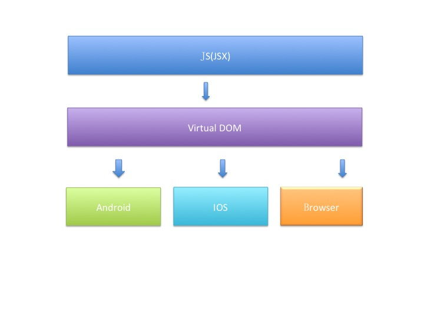
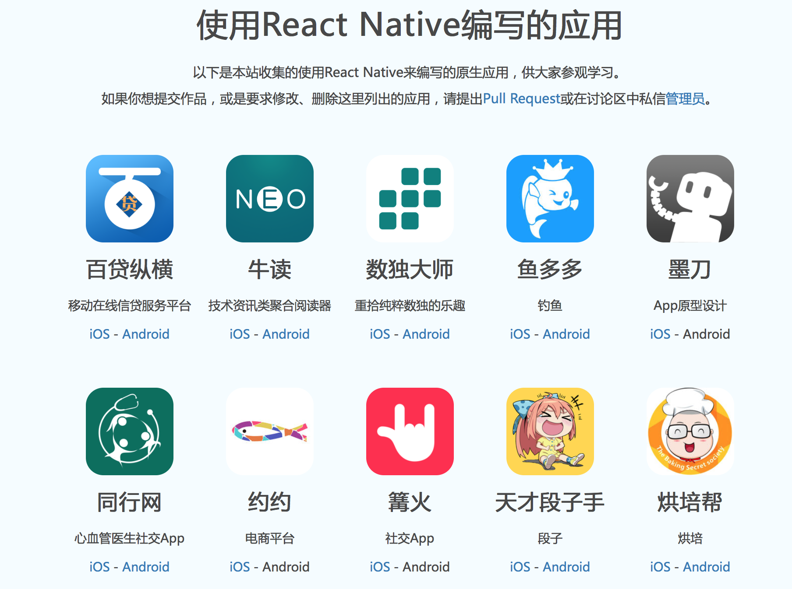
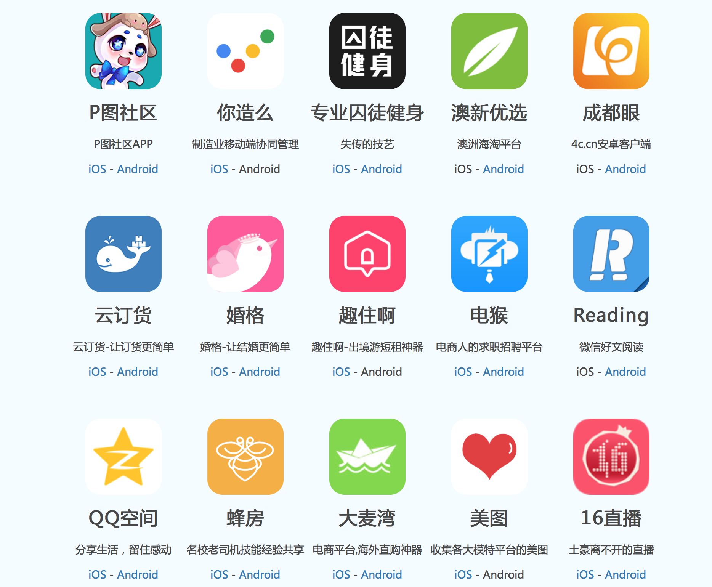
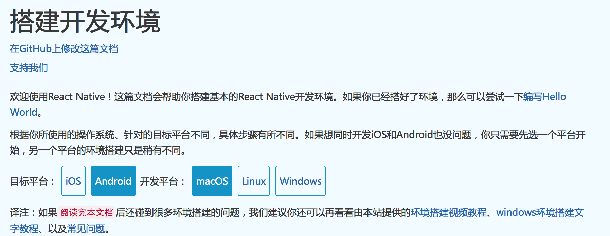
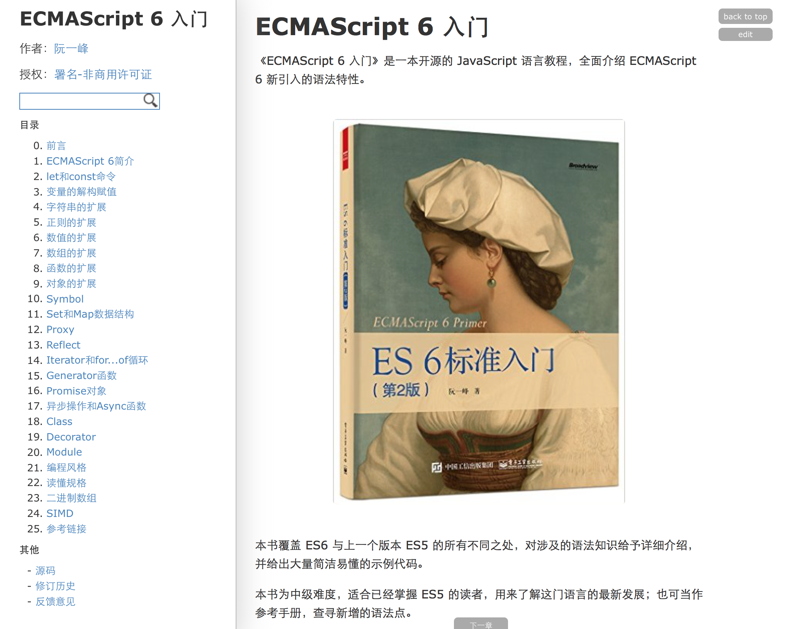
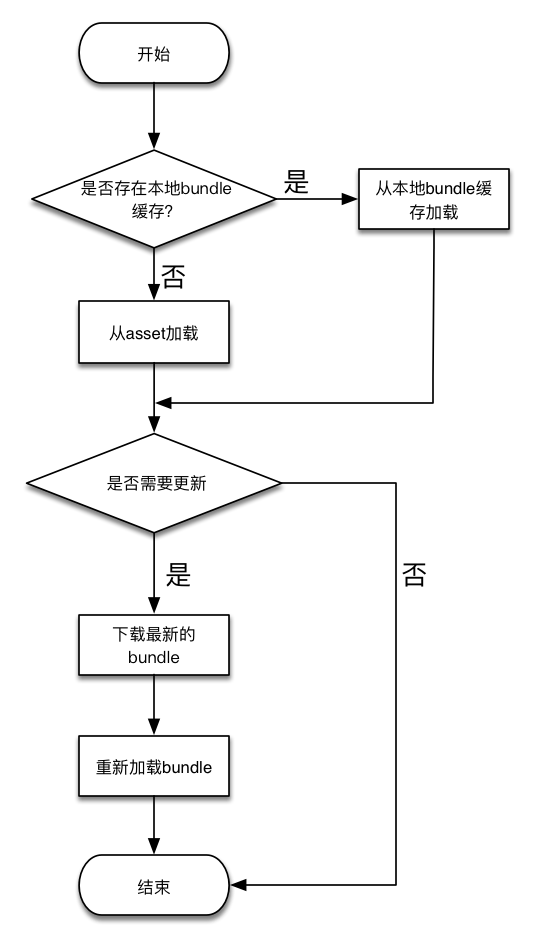
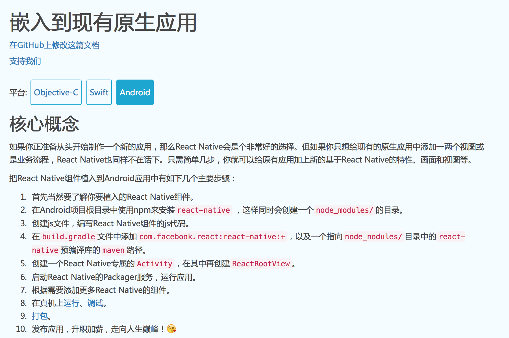
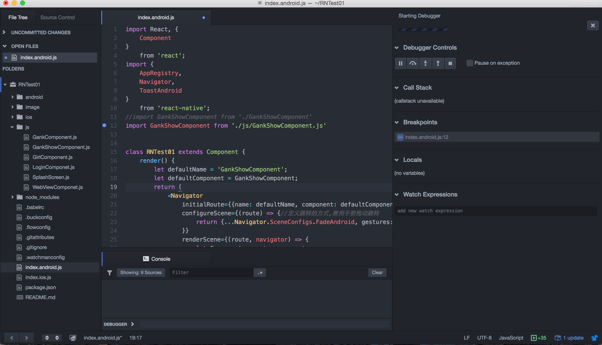
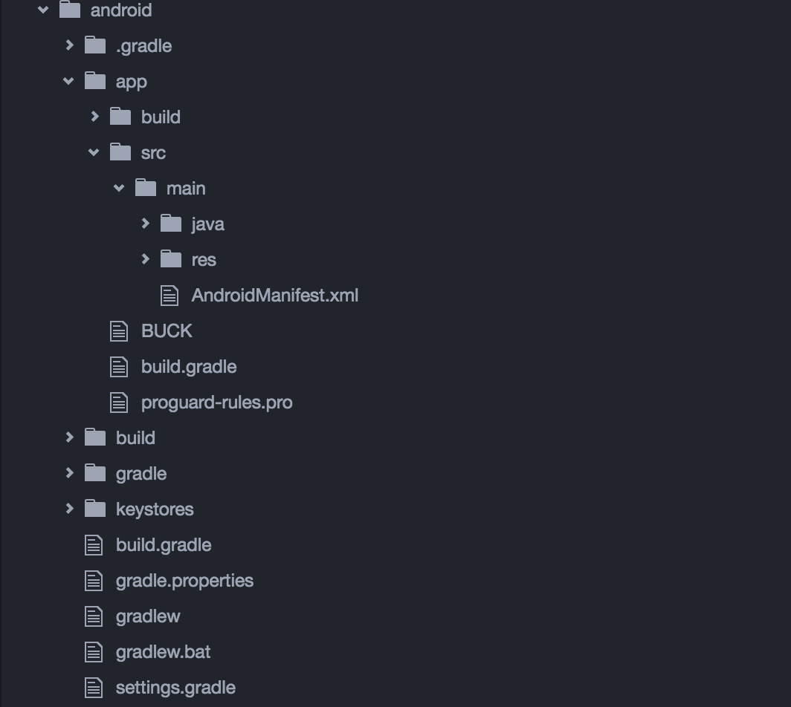

# React Native
PDF版：[React Native入门教程](./React Native.pdf)

# 认识React Native
* RN 是什么？
* RN开发的APP什么样？
* RN 有什么优势？
* RN 有什么纠结的地方？

## RN简介
  
引用官网的简介，”一个用来构建用户界面的 javascript 库”

React起源于Facebook的内部项目，因为FB对市场上所有 JavaScript MVC 框架，都不满意，就决定自己写一套，用来架设Instagram的网站。做出来以后，发现这套东西很好用，就在2013年5月开源了。
React 能够用一套代码同时运行在浏览器和 node 里。

Facebook在2015.9.15发布了 React Native for Android，把JavaScript开发技术扩展到了Android平台。React Native让开发者使用JavaScript和React编写应用，利用相同的核心代码就可以创建基于Web，iOS和Android平台的原生应用,以原生App的姿势运行在iOS和Android系统中，即拥有了web 迭代迅速的特性，又拥有原生 App 的体验。

这个姿势叫做 React-Native。
  

## 使用RN编写的应用
  
  

## 优势
* Learn once,write anywhere
* 组件化开发，组件丰富以后，ui开发较快
* 同时支持安卓和苹果的ui
* 热更新

## 纠结
* 技能树要更新；
* 各种踩坑；
* 通过搜索引擎来查找问题的解决办法是相对困难的；

## 评价
* [如何评价 React Native?](https://www.zhihu.com/question/27852694?sort=created)
* [React Native有什么优势？能跟原生比么？](https://www.zhihu.com/question/36722811?sort=created)

# 入门
主要参考：[React Native 中文网](http://reactnative.cn)
  

## 搭建环境
详见：[搭建RN开发环境](http://reactnative.cn/docs/0.39/getting-started.html)
  
注：atom+nuclide 安装 hyperclick和js-hyperclick,插件后可以跳转到源码

## 开发
### 编程语言基础  
React Native V0.18 之前采用的是 JavaScript 的 ECMAScript5 的标准，之后采用的是 ECMAScript6 (ES2016) 的标准，进行编程。这部分要学习的是 ECMA2016 [http://es6.ruanyifeng.com/](http://es6.ruanyifeng.com/)

### UI
* 使用RN原生组件
* Js使用平台组件  
例如Js想弹出一个android平台的Toast，但是Js没有实现这种toast，可以在android 代码下创建一个module，其内部调用android的Toast，然后把这个module暴露给Js调用。
* 使用自定义组件
* 引用第三方开源组件  
可以选择性install组件，例如使用 react-native-scrollable-tab-view 组件要作如下操作：
npm install react-native-scrollable-tab-view --save
* 页面跳转 及 页面之间数据传输  
js <-----> native  
js <-----> js

### 网络操作
* node-fetch包

### 数据持久化方案
* 通过RCTRootView的属性传值；
* AsyncStorage  
这是ReactNative官方的数据存储方式，采用键值对存储的方式，只能存字符串。它是简单的，异步的。用它可以取代Android的sharedperference和ios的NSUserDefault。
* react-native-sqlite
* realm
* 文件读取/写入  
通过调用native的方法

# 进阶
## 热更新
* 自己实现热更新
* 官方框架

### 自己实现

### 官方
 codepush是微软的一套用于热更新的服务，微软的github地址：[https://github.com/Microsoft/react-native-code-push](https://github.com/Microsoft/react-native-code-push)，里面讲述了详细的使用方法。

## 混合开发

## 通信机制
源码层级

# 开发实例
注：工程来自github：https://github.com/X-FAN/reactnativelearn

## 演示视频
参考现场

## 工程概览

* index.android.js是ReactNative的入口文件，后缀Android表示是在Android平台使用的代码。
* 文件夹名字‘js’是自己命名的，内含多个自定义组件。
* android 代码的文件夹，内部文件结构与AS相似，如下图所示

## 官方Demo
* [工程](https://github.com/facebook/react-native#examples)
* [实例APK](./UIExploerer_Release_V1.0.apk)

# 声明
以上内容仅针对具备Android 开发经验的Developer。
